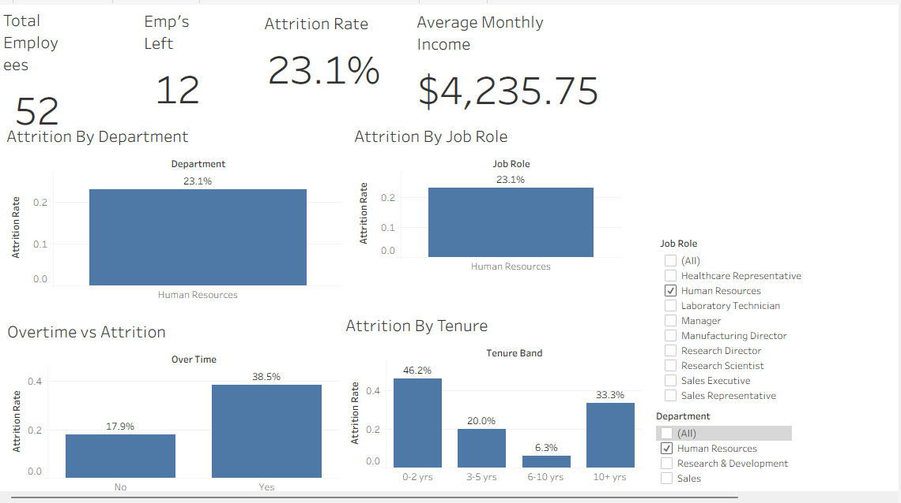

# HR Attrition & Workforce Analysis 📊

An end-to-end HR analytics project analyzing employee attrition and workforce
trends using **Microsoft Excel** and **Tableau**. This project uncovers key
drivers of employee turnover and delivers actionable insights through
interactive dashboards and structured reporting.

---

## 📌 Project Overview

Employee attrition is a major challenge for organizations. High turnover leads
to increased hiring costs, loss of institutional knowledge, and reduced team
productivity. This project dives deep into HR data to:

- Understand **who** is leaving and **why**
- Identify **high-risk** employee segments
- Support HR teams with **data-driven retention strategies**

---

## 🎯 Objectives

- Analyze overall and department-wise attrition rates
- Explore the impact of demographics on employee turnover
- Identify key factors influencing attrition (salary, satisfaction, tenure)
- Build interactive dashboards for HR decision-making
- Deliver pivot-based structured reporting via Excel

---

## 🛠️ Tools & Technologies

| Tool                  | Purpose                                              |
|-----------------------|------------------------------------------------------|
| Microsoft Excel       | Data cleaning, pivot tables, charts, reporting       |
| Tableau               | Interactive dashboards and visual storytelling       |

---

## 📂 Repository Structure

```
HR-Attrition-Workforce-Analysis/
│
├── data/
│   └── Hr_Attrition_clean_dataset.xlsx
│
├── screenshots/
│   └── dashboard_overview.png
│   └── excel_pivot_report.png
│
├── dashboard/
│   └── HR_Attrition_Dashboard.twbx
│
└── README.md
```

---

## 📋 Dataset Overview

- **File:** `Hr_Attrition_clean_dataset.xlsx`
- **Records:** ~1,470 employee records
- **Key Features:**

| Feature                | Description                            |
|------------------------|----------------------------------------|
| Age                    | Employee age                           |
| Department             | Department name                        |
| Job Role               | Employee's job role                    |
| Gender                 | Employee gender                        |
| Monthly Income         | Monthly salary                         |
| Years at Company       | Total tenure                           |
| Job Satisfaction       | Satisfaction score (1–4)               |
| Work-Life Balance      | Work-life balance score (1–4)          |
| Attrition              | Target variable — Yes / No             |

---

## 📊 Analysis Breakdown

### 🔹 Excel Analysis
- Data cleaning and formatting of raw HR dataset
- Pivot tables for department-wise and role-wise attrition
- Salary slab segmentation and attrition mapping
- Bar, pie, and line charts for trend reporting
- Conditional formatting to highlight high-risk groups

### 🔹 Tableau Dashboard
- KPI cards: Total Employees | Attrition Count | Attrition Rate
- Department-wise attrition breakdown
- Age group and gender attrition filters
- Salary vs. Attrition visual comparison
- Job satisfaction and work-life balance heatmaps
- Fully interactive filters for people analytics

---

## 📈 Key Insights

- 📌 Overall attrition rate is approximately **16%**
- 📌 **Sales** department records the highest attrition
- 📌 Employees aged **25–35** are the most at-risk group
- 📌 **Lower salary slabs** show significantly higher attrition
- 📌 Employees with **low job satisfaction** are more likely to leave
- 📌 **Single employees** show higher attrition than married counterparts
- 📌 Employees with **less than 2 years** tenure have the highest turnover

---

## 🖼️ Dashboard Preview

>   
---

## 🚀 Getting Started

1. **Clone the repository**
```bash
git clone https://github.com/subhankar-das18/HR-Attrition-Workforce-Analysis.git
```

2. **Open the dataset**
   - Navigate to `data/Hr_Attrition_clean_dataset.xlsx`
   - Open with **Microsoft Excel 2016** or later

3. **Explore the Tableau Dashboard**
   - Open the `.twbx` file in **Tableau Desktop** or **Tableau Public**
   - Use filters to explore department, age, gender, and role-wise insights

---

## 🏷️ Topics

`attrition` `attrition-analysis` `data-visualization` `excel`
`hr-analytics` `people-analytics` `tableau` `workforce-analytics`

---

## 👤 Author

**Subhankar Das**
- 🐙 GitHub: [@subhankar-das18](https://github.com/subhankar-das18)

---

## 📄 License

This project is open source and available under the
[MIT License](LICENSE).

---

> ⭐ If you found this project helpful, consider giving it a star!
